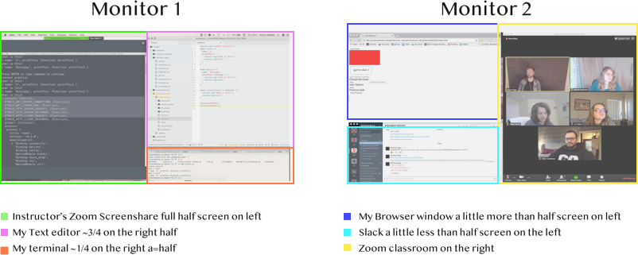

# Shortcuts-and-Setting

As a burgeoning web developer, you have a lot to learn. One really critical thing to focus on is starting good habits today. If you teach yourself the best ways to do things now, you won't have to go back and correct yourself later.  You'll also learn to code faster and have a better workflow, where you won't lose minutes switching between applications and windows. Utilizing keyboard shortcuts will also help you type faster and let you focus on the task at hand.

A lot of these steps will feel awkward at first, but the more you use them, the sooner they'll become second nature.  Part of succeeding is just taking a deep breath and taking a moment to practice the better way, then it'll get easier and easier.

There are hundreds, if not thousands, of little things you can do to make you a more effective coder. Here we're going to focus on a small group of things that will have the biggest impact for being ready for this course.

:closed_lock_with_key: We will be downloading applications to your computer.  You will need the password for your Mac in order to proceed.

## Part 1 - Spectacle
- Spectacle helps you to move and resize your screens with the a few clicks on your keypad. You no longer have to waste time using your mouse to rearrange the size of the screen.
- Not only will this help to save you time, but it will help to add to the illusion that you are a bada$$ h4ck3r.

### :computer: Click on this link https://www.spectacleapp.com/ and download and install Spectacle.

Once it's installed, you should have little glasses  at the top, right of your screen.

### Allow Spectacle
- Spectacle needs to change your computer's privacy settings to allow this application.  To do this, in your Spotlight (open with `cmd` + `space`), type **Security & Privacy** or open **Security & Privacy** from the **System Preferences** icon in the dock.  Once open, you should see this:

- Click on the lock in the bottom left.  You will be prompted to enter your computer password:

- Click on Spectacle to give it permission:

- Click on the lock again to save the changes:

### Update Spectacle Preferences

- Now, click on the glasses at the top of your screen and select `Preferences`.

- Enable Spectacle to load at login, or you will need to start the program every time you restart.

- You can update any of your spectacle preferences.  `x` on a banner and then click to 'record' your _three_ keystrokes.  
- You will likely use full screen, right half, left half and bottom half the most frequently.  

#### :hourglass: Activity (3 minutes)

- Update some of your Spectacle preferences.

#### :hourglass: Activity (3 minutes)
- Try to organize your windows using Spectacle (and then adjusting as needed) like so:

Monitors

## Part 2 - Mac Keyboard Shortcuts

### Shortcuts for any occasion!

- Here are the shortcuts that you will use most often:

| Shortcut | Description |
|:---:|:----:|
|Command-A| Select **All** Items |
|Command-C| **Copy** the selected item to the Clipboard. This also works for files in Finder|
|Command-S| **Save** file |
|Command-V| **Paste** the contents of the Clipboard into the current document or app. This also works for files in Finder |
|Command-X| **Cut** (remove) the selected item and copy it to the Clipboard|
|Command-Y| **Redo** - redo something you undid (when you've used Command-Z)|
|Command-Z| **Undo** the previous command/typing|
|Command-Shift-4| Take a screenshot |
|Command-Spacebar| Open Spotlight |

#### :hourglass: Activity (5 minutes)
- Open your Desktop or Documents in atom
- Make a file
- Copy ALL (command A)the text from this file (you can copy from the browser)
- Paste (command V) the text into your new file
- Save (command S) - there is a blue dot on the top tab of your file that should disappear once your file has successfully saved
- Undo (command Z)  - your text should go away
- Redo (command Y) - your text should come back
- Cut (Command X) - the title of your copy of this document
- Paste (Command V) - to the bottom of your copy the document
- Save (Command S) - one final time
- take a screenshot of something

:computer:  [Additional Mac Keyboard Shortcuts](https://support.apple.com/en-us/HT201236)
